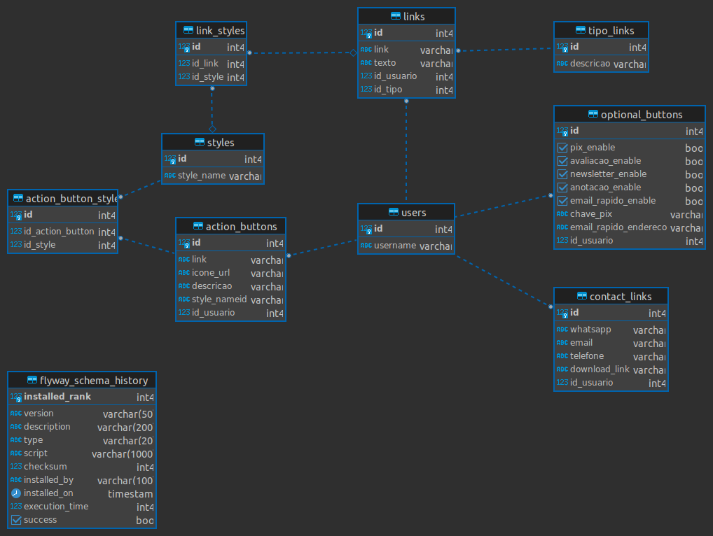

# Digital Business Card Backend
Backend do serviço de Cartão de Visitas Digital

## Swagger: [Clique Aqui](https://wiriswernek.github.io/digital-business-card-backend/)

<h2 align="center">Diagrama Entidade Relacionamento</h2>

	

Swagger baseado na [documentação](https://swagger.io/docs/open-source-tools/swagger-ui/usage/installation/)
